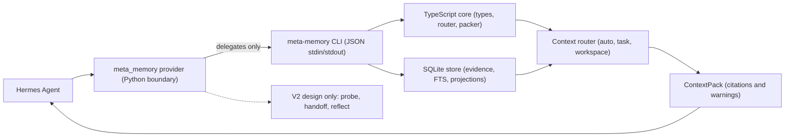

Agent Memory OS is a compiler-style memory framework for Hermes Agent. Hermes
sees one external provider, `meta_memory`; the provider keeps multiple
auditable memory planes behind that boundary.

## Operating Principle

Event-sourced writes, multi-view storage, routed reads, verified injection.

## Boundary Ownership

| Boundary | Owner | Rule |
| --- | --- | --- |
| Memory behavior | TypeScript | Owns schema, storage, routing, packing, verification, CLI, tests, evals, and orchestration. |
| Hermes plugin interface | Python | Translates Hermes lifecycle and tool calls to the TypeScript CLI only. |
| Detailed documentation | Starlight | Keeps architecture, data model, CLI, evaluation, install, roadmap, and research context canonical. |

This repo is TypeScript-first, not TypeScript-only. Python is required only
where Hermes needs a Python plugin module.

## Why One Hermes Provider

Hermes can activate only one external memory provider at a time while built-in
Hermes memory remains active. Agent Memory OS therefore exposes one provider and
keeps internal memory choices behind it.

The provider boundary stays small:

- automatic bounded context packing;
- explicit memory writes;
- local search;
- active session-state updates;
- workspace resource updates and browsing;
- verification recording;
- future graph, reflection, and handoff tools only after V1/V1.1 are stable.

Future tools such as probe, handoff, and reflect should remain behind the same
provider boundary. They should not become separate Hermes providers.

## Memory Planes

| Plane | Status | Purpose |
| --- | --- | --- |
| Pinned core memory | V1 implemented | High-authority rules and durable facts that should not require retrieval. |
| Evidence ledger | V1 implemented | Append-only events for messages, tool calls, outcomes, file edits, and explicit memory writes. |
| Typed semantic facts | V1 implemented | Cited fact records separated from raw evidence. |
| Local retrieval | V1.1 implemented | SQLite + FTS over evidence, facts, session state, and workspace resources. |
| Context router | V1.1 implemented | Bounded context packs with `auto`, `task`, and `workspace` policies. |
| Verification records | V1.1 implemented | Writable statuses plus latest non-passed warnings in context packs. |
| Active session state | V1.1 implemented | Compact current-task state without LLM extraction. |
| Workspace resources | V1.1 implemented | Browseable project/resource memory without graph or cloud dependencies. |
| Temporal graph | V2 design | Validity windows, supersession, and relation-aware recall. |
| Reflection | V2 design | Slow-path synthesis over evidence, facts, and temporal projections. |
| Handoff and social memory | V2+ design | Multi-agent transfer packets and peer/identity memory. |

## Write Path

All memory writes should preserve raw evidence first. Facts, context packs,
verification records, session state, workspace resources, and future projections
derive from that evidence.

Write policy:

- never mutate evidence;
- rarely delete facts;
- usually supersede beliefs;
- often expire temporary state.

This avoids the failure mode where the system throws away useful information at
write time and later tries to recover it with search.

## Read Path

The read path is routed:

1. Prefer pinned core memory for standing rules and stable preferences.
2. Use FTS retrieval for explicit facts and evidence.
3. Include active session state for `auto` and `task` policies.
4. Include workspace resources for `auto` and `workspace` policies.
5. Build bounded context packs with citations and latest verification warnings.
6. Defer graph and reflection work until V2.

## Trust Boundary

Injected memory should be inspectable and cited. The adapter prompt block should
tell Hermes to use injected memory only when relevant and cite memory
identifiers when relying on them.

If the plugin is installed but the CLI is not ready, the prompt block tells
Hermes to call `meta_memory.status` before relying on memory tools. Context
packs include latest non-passed verification records for packed item IDs.

## Adapter Compatibility Risk

Current repo code aligns the local adapter to root and nested `plugin.yaml`
manifests, `register(ctx)`, `initialize(...)`, provider tool schemas, optional
setup-skill registration, and lifecycle hook wiring.

This is local contract proof only. Before claiming production Hermes
compatibility, verify that a target Hermes checkout loads the plugin and
exercises the registered tools and hooks end to end.
