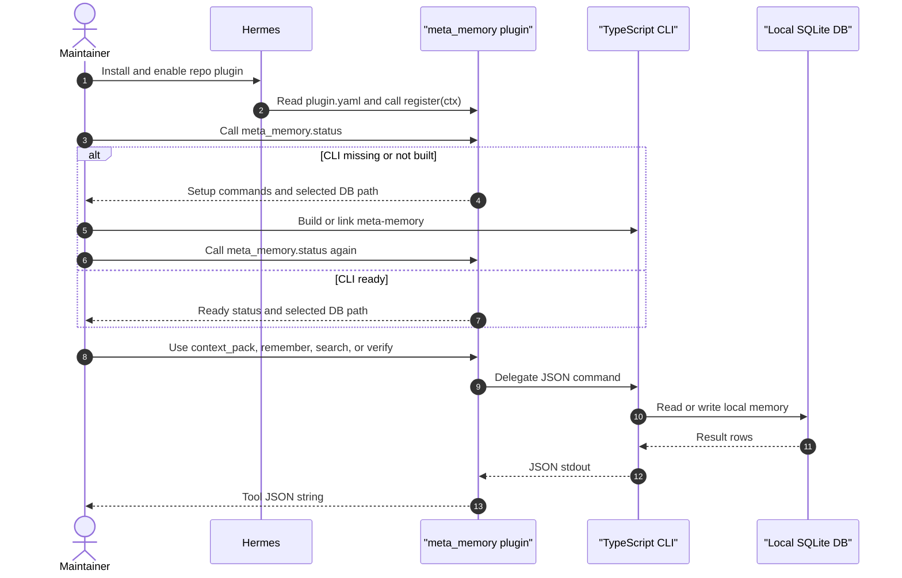

Use this page when installing or configuring the Agent Memory OS Hermes plugin.
The steps are intentionally cautious: this repo has local adapter and CLI smoke
proof, but it does not claim production Hermes runtime validation for a specific
Hermes release.

## Before You Install

Verify the target Hermes version and plugin contract. Current Hermes
documentation describes:

- `plugin.yaml` metadata;
- a Python `register(ctx)` entrypoint;
- lifecycle hooks;
- tool schemas registered with handlers.

Python is only the Hermes boundary. It maps Hermes calls to the TypeScript CLI
and must not own memory schema, ranking, persistence, retrieval, verification
policy, or product behavior.

## Prerequisites

- Node.js and pnpm that satisfy the repo `engines`.
- Python 3 for the Hermes provider shim.
- A built `@agent-memory-os/cli` package before memory tools are ready.

The plugin can be installed before the CLI is configured. In that state, use the
Hermes `meta_memory.status` tool to see the missing command, selected SQLite
path, and next setup commands.

## Build The CLI

```bash
pnpm install
pnpm --filter @agent-memory-os/cli build
```

For local development, point Hermes at the built CLI when you do not want to
link a global bin:

```bash
export META_MEMORY_CLI="node '$PWD/packages/cli/dist/index.js'"
```

If Hermes expects an executable command, install or link the `meta-memory` bin
and leave `META_MEMORY_CLI` unset:

```bash
pnpm --filter @agent-memory-os/cli link --global
```

## Adapter Settings

| Variable | Required | Purpose |
| --- | --- | --- |
| `META_MEMORY_CLI` | No | Command used when `meta-memory` is not on `PATH` and repo-local CLI auto-detection should not be used. |
| `META_MEMORY_DB` | No | Local SQLite path. Defaults to Hermes home or `~/.hermes/meta-memory.sqlite`. |
| `META_MEMORY_TIMEOUT_SECONDS` | No | Adapter subprocess timeout. Defaults to `20` and must be positive. |

Tool-call arguments cannot override the configured database path. The adapter
creates the parent directory for file-backed `META_MEMORY_DB` paths.

## Install The Plugin

For user-facing Git installs, point Hermes at the repository root. The root
`plugin.yaml` and `__init__.py` are a shim that delegates to the nested adapter:



```bash
hermes plugins install optiflow/agent-memory-os --enable
```

After install, call `meta_memory.status`. If the CLI is not ready, run the
reported setup commands, then call `meta_memory.status` again before using
memory tools.

For Hermes maintainers or vendoring, inspect the implementation boundary here:

```text
adapters/hermes/plugins/memory/meta_memory
```

For a real Hermes checkout, still follow that release's plugin installation path
and enablement rules. Confirm that Hermes discovers `plugin.yaml`, imports the
Python module, calls `register(ctx)`, runs any required `initialize(...)` bridge
setup, registers the setup skill when `register_skill(...)` is available, and
registers the expected lifecycle hooks and tool schemas.

Do not treat local smoke output as proof of a live Hermes install.

## Smoke Check Before Hermes

Compile the adapter and run its stdlib tests:

```bash
python3 -m py_compile __init__.py
python3 -m py_compile adapters/hermes/plugins/memory/meta_memory/__init__.py
python3 -m unittest discover adapters/hermes/plugins/memory/meta_memory/test
pnpm adapter:check
```

Then verify the CLI path and SQLite path together:

```bash
tmp_dir="$(mktemp -d)"
echo "{\"dbPath\":\"$tmp_dir/memory.sqlite\"}" \
  | node packages/cli/dist/index.js seed-sample
echo "{\"dbPath\":\"$tmp_dir/memory.sqlite\",\"query\":\"Biome formatter\",\"budgetTokens\":400}" \
  | node packages/cli/dist/index.js context-pack
```

The context-pack output should include `contextPack`, the seeded Biome memory,
sample session state, and sample workspace resource records.

This proves the adapter can compile, call the TypeScript CLI, and use the
configured SQLite path locally. It does not prove Hermes plugin discovery,
enablement, runtime hook execution, or production installation for a specific
Hermes release.

## Installed Tools

The adapter exposes these Hermes-facing tools:

- `status`
- `context_pack`
- `remember`
- `search`
- `upsert_session_state`
- `upsert_resource`
- `browse_resources`
- `verify`

`handoff` and `reflect` are intentionally deferred to V2.
