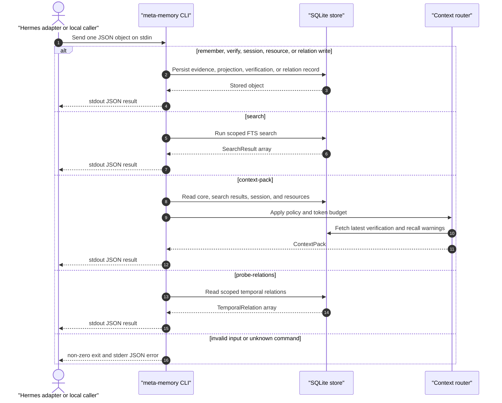

`meta-memory` is a JSON stdin/stdout bridge for Hermes and local smoke tests.
It reads one JSON object from stdin and writes one JSON object to stdout.

Build it before invoking the generated CLI directly:



```bash
pnpm --filter @agent-memory-os/cli build
```

Then call a command:

```bash
echo '{"dbPath":":memory:","query":"Biome","budgetTokens":400}' \
  | node packages/cli/dist/index.js context-pack
```

## Shared Inputs

| Field | Default | Notes |
| --- | --- | --- |
| `dbPath` | `META_MEMORY_DB`, then `:memory:` | SQLite path. |
| `scope` | `{ "type": "workspace", "id": "default" }` | Optional memory scope. |
| `metadata` | omitted | Optional JSON object where supported. |
| `workspacePath` | omitted | Optional context-pack workspace root for local drift checks. |

If neither `dbPath` nor `META_MEMORY_DB` is set, direct CLI calls use
`:memory:`. Those calls are ephemeral and are not equivalent to the Hermes
adapter's file-backed default database.

`scope` partitions local memory. The default workspace scope is suitable for
smoke tests, but real callers should pass a stable `type` plus `id` so unrelated
memories do not collide.

## `remember`

Purpose:

Append an evidence event.

Required fields:

- `content`: non-empty string.

Optional fields:

- `kind`: evidence kind, defaults to `explicit_memory`.
- `actor`: `assistant`, `system`, `tool`, or `user`; defaults to `user`.
- `scope`
- `metadata`

Returns:

```text
{ "event": EvidenceEvent }
```

Notes:

- This command records evidence only. It does not create semantic facts
  automatically.

## `search`

Purpose:

Search local evidence, facts, active session state, and workspace resources with
SQLite FTS.

Required fields:

- `query`: non-empty string.

Optional fields:

- `limit`: positive integer, defaults to `10`.
- `scope`: narrows FTS search to a memory scope.

Returns:

```text
{ "results": SearchResult[] }
```

Notes:

- Core memory blocks are included through `context-pack`, not raw `search`.

## `context-pack`

Purpose:

Build a bounded context pack for injection or inspection.

Required fields:

- `query`: non-empty string.

Optional fields:

- `budgetTokens`: positive integer, defaults to `1200`.
- `policy`: `auto`, `task`, or `workspace`; defaults to `auto`.
- `workspacePath`: local workspace root used for git/file drift checks.
- `scope`

Returns:

```text
{ "contextPack": ContextPack }
```

Notes:

- `auto` includes active session state and workspace resources.
- `task` excludes workspace resource search.
- `workspace` excludes active session state.
- V2 Core recall warnings are additive. Risky items stay visible in `items` and
  warnings are returned in `recallWarnings`.

## `verify`

Purpose:

Record verification status for a memory item.

Required fields:

- `targetId`: non-empty string.
- `message`: non-empty string.

Optional fields:

- `status`: `failed`, `passed`, `stale`, `unknown`, or `warning`; defaults to
  `unknown`.

Returns:

```text
{ "verification": VerificationRecord }
```

Notes:

- Latest non-passed records are included as warnings in context packs for packed
  item IDs.

## `add-relation`

Purpose:

Add a scoped temporal relation between memory items.

Required fields:

- `fromId`: non-empty source item ID.
- `toId`: non-empty target item ID.
- `relation`: `contradicts`, `derives`, `extends`, `supports`, or
  `supersedes`.

Optional fields:

- `validFrom`: non-empty timestamp string.
- `validUntil`: non-empty timestamp string.
- `sourceEventIds`: array of evidence event IDs.
- `scope`
- `metadata`

Returns:

```text
{
  "event": EvidenceEvent,
  "relation": TemporalRelation
}
```

Notes:

- This is a projection write. The CLI appends an audit evidence event before
  storing the relation.
- `contradicts` and `supersedes` can produce V2 Core recall warnings in context
  packs.

## `probe-relations`

Purpose:

Inspect scoped temporal relations connected to a memory item.

Required fields:

- `targetId`: non-empty memory item ID.

Optional fields:

- `relation`: narrows results to one relation type.
- `limit`: positive integer, defaults to `20`.
- `scope`

Returns:

```text
{ "relations": TemporalRelation[] }
```

## `upsert-session-state`

Purpose:

Create or update compact active task state.

Required fields:

- `id`: non-empty session-state identifier.
- `currentGoal`: non-empty current goal.
- `summary`: non-empty bounded task summary.

Optional fields:

- `status`: `active`, `blocked`, or `complete`; defaults to `active`.
- `workingSet`: array of strings.
- `scope`
- `sourceEventIds`
- `metadata`

Returns:

```text
{
  "event": EvidenceEvent,
  "sessionState": SessionState
}
```

Notes:

- This is a projection write. The CLI appends an audit evidence event before
  updating the projection table.

## `upsert-resource`

Purpose:

Create or update a browseable workspace resource.

Required fields:

- `uri`: non-empty resource URI.
- `title`: non-empty display title.
- `content`: non-empty searchable content.

Optional fields:

- `kind`: `doc`, `file`, `note`, `other`, or `url`; defaults to `file`.
- `parentUri`: non-empty parent resource URI.
- `scope`
- `sourceEventIds`
- `metadata`

Returns:

```text
{
  "event": EvidenceEvent,
  "resource": WorkspaceResource
}
```

Notes:

- This is a projection write. The CLI appends an audit evidence event before
  updating the projection table.

## `browse-resources`

Purpose:

List workspace resources under an optional parent URI.

Required fields:

- None.

Optional fields:

- `parentUri`: parent resource URI; omitted lists root resources.
- `limit`: positive integer, defaults to `50`.
- `scope`

Returns:

```text
{ "resources": WorkspaceResource[] }
```

## `seed-sample`

Purpose:

Create sample core, evidence, fact, session-state, and workspace-resource
records for smoke testing.

Required fields:

- None.

Optional fields:

- `dbPath`
- `scope`

Returns:

```text
{
  "coreBlock": CoreMemoryBlock,
  "event": EvidenceEvent,
  "fact": SemanticFact,
  "sessionState": SessionState,
  "resource": WorkspaceResource
}
```

Notes:

- Use this command for local smoke tests, not as a production seeding contract.

## Error Contract

The CLI exits non-zero and writes an error object to stderr when input is
invalid or the command is unknown.

The Hermes adapter treats non-zero exits, empty stdout, and invalid JSON as
adapter failures.
