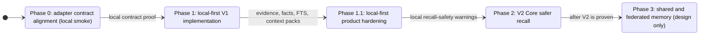

This roadmap preserves the local-first V1 boundary while keeping the report's
larger Meta Memory OS direction visible. The product shape is one Hermes
provider with many internal planes, not several competing providers.

## Phase 0: Adapter Contract Alignment

Before adding runtime features, align the Hermes adapter boundary to the current
local plugin contract and prove it locally:

- `plugin.yaml` metadata and required fields;
- root plugin shim for Git-based Hermes plugin installs;
- Python `register(ctx)` entrypoint and discovery shape;
- `initialize(...)` bridge setup;
- lifecycle hook names and current `on_session_end` registration;
- tool schemas and handler registration for `status`, `context_pack`,
  `remember`, `search`, V1.1 session/resource tools, and `verify`;
- optional setup-skill registration when Hermes exposes `register_skill(...)`;
- local smoke proof for adapter compilation, manifest shape, `initialize(...)`,
  `register(ctx)`, tool schemas, `status` diagnostics, CLI delegation,
  configured SQLite path handling, and tool-call argument boundaries.

Until this is loaded and exercised by a real target Hermes version, adapter work
remains a local contract alignment and smoke-test target, not a production
Hermes installation claim.

## Phase 1: Local-First V1 Implementation

V1 is the minimum auditable Hermes meta-provider:

- TypeScript domain model.
- SQLite schema and FTS indexes.
- Append-only evidence events.
- Core memory blocks.
- Semantic facts with source event IDs.
- Context packs with token estimates and citations.
- Verification records.
- CLI bridge for JSON stdin/stdout.
- TypeScript/Vitest tests for core, SQLite, and CLI behavior.
- pnpm and Turborepo orchestration.
- Thin Hermes Python adapter that maps Hermes hooks and tools to the TypeScript
  CLI only.

V1 does not include vector search, graph databases, cloud providers, LLM
extraction, reflection, connector sync, social memory, or a second Hermes
provider.

## Phase 1.1: V1 Product Hardening

These are implemented as local-first, dependency-light projections:

- active session-state projection for compact current-task memory;
- browseable workspace/resource tree;
- richer context-router policy with `auto`, `task`, and `workspace` modes;
- local adapter smoke fixture for manifest shape, `initialize(...)`,
  `register(ctx)`, tool schemas, handler delegation, and hook signatures.

Any later local-first additions must stay auditable and dependency-light.
Session state and workspace tree work must continue to avoid vector DBs, graph
DBs, cloud memory providers, connector sync, and LLM extraction dependencies.

This is still not a production Hermes installation claim until a target Hermes
checkout loads the plugin and exercises the hooks/tools end to end.

## Phase 2: V2 Core Safer Recall

V2 Core is implemented as local-first recall-safety warnings:

- scoped temporal relation storage;
- active `contradicts` and `supersedes` warnings in context packs;
- source citation validation for packed facts, session state, and resources;
- optional current-branch, commit, missing-file, and file-hash drift warnings
  when context-pack requests include local workspace provenance;
- `add-relation` and `probe-relations` CLI commands plus matching Hermes tool
  delegation.

V2 Core does not filter risky memory. It keeps packed items visible and returns
structured `recallWarnings` so the agent can inspect the risk.

Future V2 work remains design only:

- richer temporal graph reasoning and validity-window conflict handling;
- optional reflection for synthesis-heavy prompts;
- handoff packets if multi-agent workflows need them.

Future graph and reflection work should stay routed. It should run only when the
query needs temporal, relational, or inferential reasoning.

## Phase 3: Shared And Federated Memory

Social and peer memory, external connector sync, shared memory blocks, and
federation hooks belong after V1 is stable and V2 recall safety is proven.

## Operating Guardrails

- Evidence stays append-only.
- Facts stay typed, cited, and updateable.
- Context packs stay bounded and inspectable.
- Project and workspace memory stay separate from personal profile memory.
- Provider-landscape claims from the report remain roadmap guidance until they
  are rechecked against primary docs.
